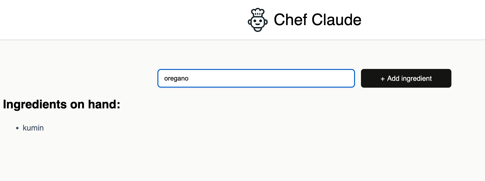
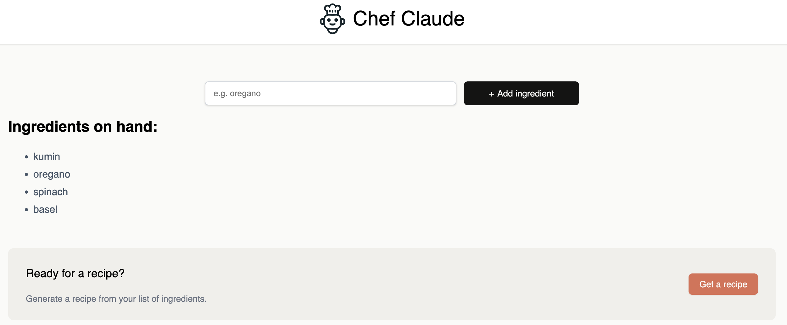
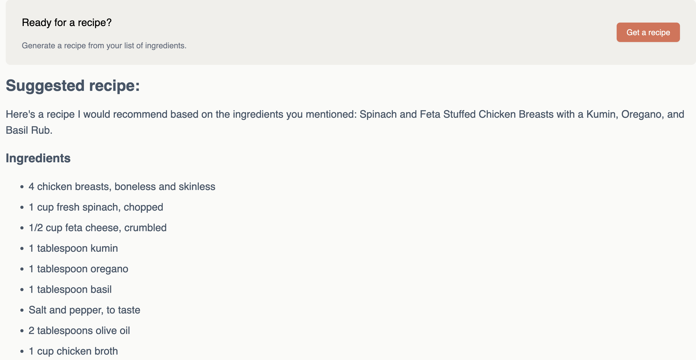

# AI Chef App

App that uses HuggingFace AI API to get recipes, based on user input of 4 or more ingredients

Made with React, and by following a UI/UX design from Figma

Enter at least 4 ingredients

Click 'Get a recipe'

HuggingFace API gets a recipe based on 4 (or more) added ingredients

